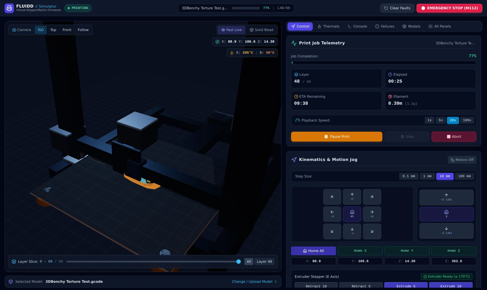
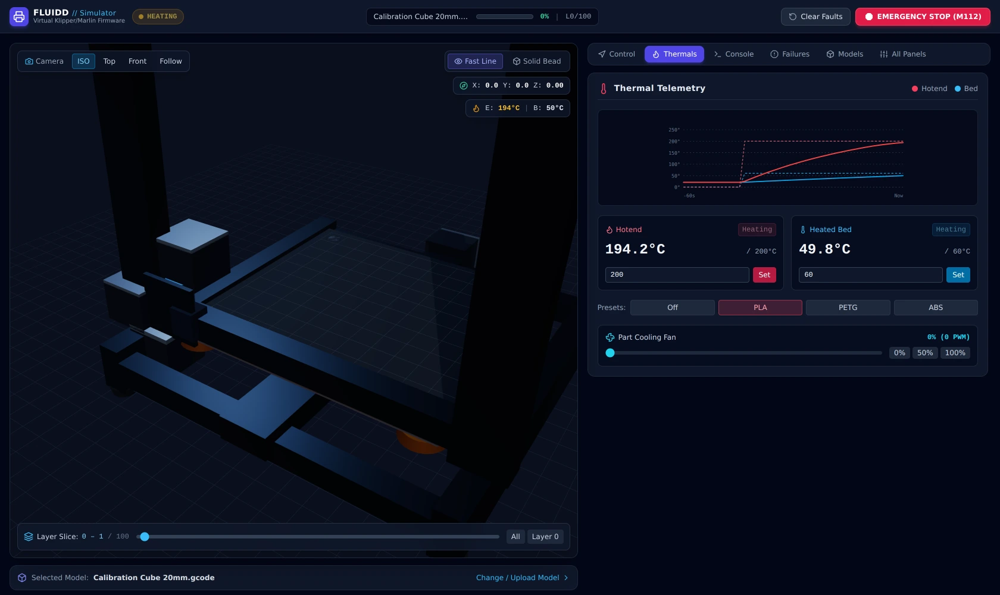
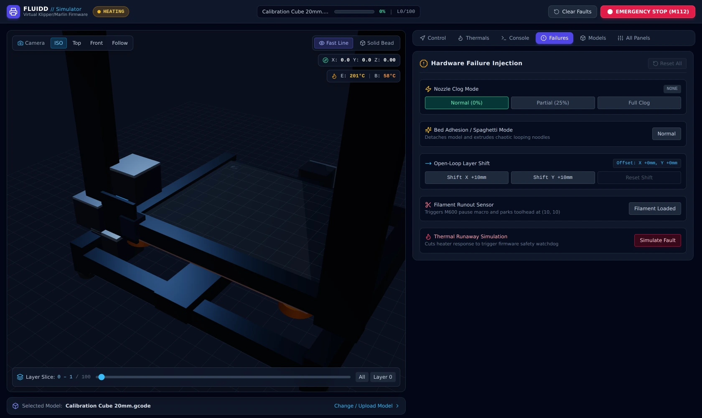

# 3D Printer Simulator

> *"i'm so excited to get a 3d printer but I can't buy it"*

So this is one, in a browser tab. Real G-code goes in, a real Cartesian machine
moves, the hotend obeys an actual heat equation, and every way a print goes
wrong — clogs, layer shifts, runout, spaghetti — is a button you can press.



**[Quick start](#quick-start) · [What it actually simulates](#what-it-actually-simulates) · [Breaking it on purpose](#breaking-it-on-purpose) · [How it is built](#how-it-is-built)**

---

## Quick start

```bash
npm install
npm run dev          # http://localhost:5173
```

Then, in about sixty seconds:

1. **Models** → pick *Quick Test Pad* (five layers, prints in under two minutes).
2. **Control** → **Start Print**. Watch the toolhead lay beads onto the bed.
3. Bump playback to **20x**. The physics runs at the same rate; only the clock moves.
4. **Failures** → **Full Clog**. Motion continues, extrusion stops, the part stops growing.
5. **Console** → type `M114`. The virtual firmware answers like firmware does.

Drag any real `.gcode` file onto the model panel and it will print that instead.

| Command | What it does |
| --- | --- |
| `npm run dev` | Dev server with hot reload |
| `npm run build` | TypeScript check + production bundle into `dist/` |
| `npm run preview` | Serve the production bundle |
| `npm test` | 430 unit and end-to-end tests |
| `npm run smoke` | 13 production checks against the built bundle |
| `npm run verify` | Build, then test, then smoke — what CI runs |

Requires Node 18+. Rendering needs WebGL2, so use a current browser.

---

## What it actually simulates

The point of this project is that nothing is faked. Every number on screen comes
out of a model.

### Thermal

The hotend and bed are first-order thermal systems driven by discrete PID
controllers, integrated with the exact solution rather than a Euler step:

$$\frac{dT}{dt} = u \cdot k_{heat} - \lambda (T - T_{ambient}), \qquad \lambda = k_{cool} + k_{fan} \cdot \text{fan}$$

which integrates to `T(t+Δt) = T∞ + (T(t) − T∞)·e^(−λΔt)`, sub-stepped at 100 ms
so the controller and the watchdogs see a stable clock at any playback speed.
That is why the heat-up curve bends the way a real one does, why the part
cooling fan costs the hotend a few degrees of headroom, and why the bed — with
far more thermal mass — takes so much longer to reach 60 °C than the nozzle
takes to reach 205 °C.



Two Marlin-spec safety watchdogs run on top of it, and both can be provoked:

- **Rise check** — heater saturated at full power but the temperature is not
  climbing → thermal runaway, `M112`, everything halts.
- **Drift check** — a heater that reached its setpoint then fell more than 10 °C
  below it for 15 seconds under full power → same.

Cold extrusion below 170 °C is refused, the way firmware refuses it.

### Motion

Cartesian kinematics with per-axis soft limits on the build volume. Moves are
interpolated in time rather than stepped per line, so the toolhead arrives where
the G-code says it should and the deposited bead follows the real path — the
interpolator carries both a linear and a trapezoidal acceleration profile.
Homing, workspace offsets (`G92`), and absolute/relative modes for both position
and extrusion behave as firmware does.

### G-code

| Supported | |
| --- | --- |
| Motion | `G0` `G1` `G28` `G90` `G91` `G92` |
| Hotend | `M104` `M109` |
| Bed | `M140` `M190` |
| Fan | `M106` `M107` |
| Extrusion | `M82` `M83` |
| Machine | `M84` `M112` `M114` `M105` |

Three models ship with the project — a 20 mm calibration cube (100 layers), a
3DBenchy (60 layers), and a five-layer test pad — plus drag-and-drop for your
own files.

### Rendering

Toolpaths land in one pre-allocated buffer geometry that doubles in capacity as
a print grows, so a quarter-million-segment job is still a single draw call
rather than a quarter-million objects. Segments are typed (outer
wall, inner wall, infill, support, travel) and coloured accordingly, and the
layer scrubber slices the stack without rebuilding it. A second mode swaps
hairlines for instanced volumetric beads when you want to see filament rather
than paths.

---

## Breaking it on purpose

The failure modes are the reason this is more interesting than a G-code viewer.
Each one is a physical mechanism, not a texture swap.



| Failure | What the simulator does |
| --- | --- |
| **Nozzle clog** | Scales extrusion flow to 25 % or 0 % while motion continues — the toolhead keeps drawing the part in the air |
| **Bed adhesion loss** | Detaches the part and generates curling noodles under Brownian motion, procedurally, layer by layer |
| **Layer shift** | Applies a permanent open-loop offset on X or Y, exactly as a skipped stepper would: every later layer inherits the error |
| **Filament runout** | Trips the sensor mid-print, pauses the job the way an `M600` would, parks the toolhead at (10, 10) |
| **Thermal runaway** | Cuts heater response so the safety watchdog has to catch it |

---

## How it is built

```
src/
  core/
    kinematics/   Cartesian axes, motion interpolation, toolpath segments
    gcode/        parser, execution engine, bundled sample models
    thermal/      heat model, PID controllers, safety watchdogs
    failures/     failure manager, spaghetti generator
    telemetry/    single state store the UI subscribes to
  viewport/       Three.js scene, chassis/bed/toolhead meshes, buffer manager
  components/     Fluidd-style dashboard panels
  test/           unit + 5-tier end-to-end suites, production smoke runner
```

The whole simulation core is plain TypeScript with no React and no Three.js
imports. React subscribes to it and Three.js draws it, but neither is load
bearing — which is why the entire physics stack is testable in Node, and why
the test suite can run a full print start to finish without a browser.

**Stack:** React 18 · TypeScript · Three.js / WebGL2 · Tailwind · Vite · Vitest

### Tests

```bash
npm run verify
```

430 tests across 18 files: unit coverage of each subsystem, then five
end-to-end tiers — feature coverage, boundary cases, pairwise feature
interactions, real-world print scenarios, and adversarial stress. Plus 13 smoke
checks that run against the built bundle rather than the source.

The scenario tier is the one that earns its keep: it prints every bundled model
to completion against the constants the app actually ships with. An earlier
version of the hotend calibration left the block unable to hold its setpoint
once the part cooling fan reached 100 %, so every print emergency-halted about
a fifth of the way in — and nothing caught it, because no test had ever run a
sample to the end.

---

## License

MIT — see [LICENSE](LICENSE).

Built by [Ben Skamps](https://brokenbranch.dev).
